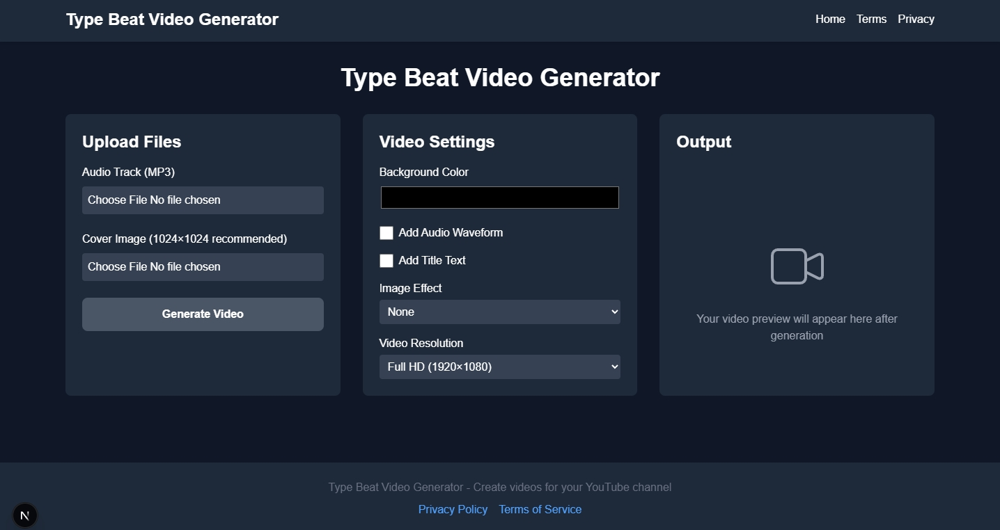

# Type Beat Video Generator

  
_Create professional type beat videos for YouTube directly in your browser!_

**Type Beat Video Generator** is a web-based tool built with Next.js that allows music producers and content creators to generate YouTube-ready videos by combining audio tracks with images, customizable waveforms, titles, and effects—all processed locally in your browser.

## Features

- **Audio & Image Upload**: Upload MP3 files and images to create your video.
- **Customizable Settings**: Adjust video resolution, background color, waveform visuals, title text, and image effects (pulse, slow zoom).
- **In-Browser Processing**: No server uploads—everything happens locally for privacy and speed.
- **YouTube-Ready Output**: Download videos in WebM format, fully compatible with YouTube.
- **Responsive Design**: Works seamlessly on desktop and mobile devices.
